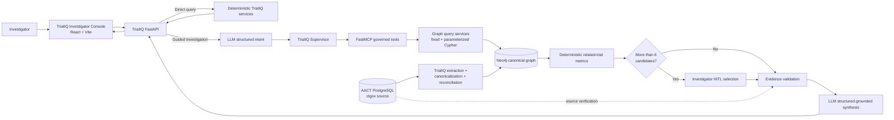

# TrialIQ

**TrialIQ is an evidence-grounded clinical-trial intelligence workspace for investigating a study, discovering related trials through a governed knowledge graph, comparing source-backed study attributes, validating evidence, and producing an auditable investigator-facing answer.**

TrialIQ is currently a **stable demo / technical-preview baseline**. It is designed to demonstrate how deterministic clinical-trial retrieval, graph reasoning, human review, validation, and LLM synthesis can work together without giving the model unrestricted database access or allowing it to invent quantitative comparisons.

> **Evidence-support scope:** TrialIQ supports investigation of loaded clinical-trial data. It is not a clinical decision system and clinically consequential conclusions should be verified against the underlying source records.

## What TrialIQ does

TrialIQ supports two complementary paths:

- **Direct / deterministic retrieval** for simple study lookup and evidence-grounded overview tasks.
- **Guided investigation** for related-study discovery and comparison through a governed agent workflow.

The guided path is intentionally constrained:

```text
Investigator question
  -> LLM call 1: structured intent
  -> TrialIQ supervisor
  -> FastMCP governed retrieval tool
  -> bounded Neo4j traversal
  -> deterministic comparison metrics
  -> deterministic evidence / grounding validation
  -> optional human review when the result set is broad
  -> LLM call 2: structured grounded synthesis
  -> Investigator UI
```

The normal guided path does **not** introduce arbitrary model-generated Cypher, silent MCP-to-database fallback, unbounded graph traversal, or a third LLM call just to validate the answer.

## Architecture at a glance



The detailed architecture, sequence, data-lineage, graph-domain, HITL, UI-flow, readiness, release-gate and use-case diagrams live under [`docs/diagrams/`](docs/diagrams/README.md).

## Investigator workflow

The current investigator experience is deliberately progressive rather than exposing every technical detail at once:

```text
Study selection
   -> Question
   -> TrialIQ discovery
   -> HITL study selection when candidate_count > 6
   -> Answer
   -> Studies
   -> Connections
   -> Evidence
   -> Prepare report
   -> PDF
```

Key behaviors include:

- searchable study-of-interest selection;
- guided and direct query modes;
- broad-query human review with **Analyse selected** and **Analyse all**;
- related-study comparison across source-backed dates, duration and enrollment when available;
- connection explanations through canonical **Condition**, **Intervention**, and **Sponsor** entities;
- a progressive technical graph explorer with Network/Table views;
- evidence/provenance inspection;
- deterministic PDF report generation with investigator-selected sections.

## Why agentic AI here?

TrialIQ does not use an LLM simply to rewrite search results. The model is used where language understanding and synthesis are useful, while TrialIQ keeps retrieval and quantitative truth under deterministic control.

| Responsibility | TrialIQ owner |
| --- | --- |
| Understand the investigator's question | LLM structured intent |
| Choose and coordinate a supported investigation | TrialIQ supervisor |
| Access graph capabilities | FastMCP governed tools |
| Traverse related trials | Fixed, bounded, allowlisted Cypher |
| Calculate date/enrollment differences | Deterministic backend logic |
| Decide whether broad results need review | Deterministic HITL threshold |
| Approve the evidence set when broad | Investigator |
| Validate retrieved evidence | Deterministic validators |
| Produce the final natural-language synthesis | LLM structured synthesis |

See [`docs/02-why-agentic-ai.md`](docs/02-why-agentic-ai.md) for the full design rationale.

## Data model and evidence boundaries

AACT/PostgreSQL is the structured source used to build and verify the TrialIQ graph. Neo4j is the canonical related-study graph used at runtime.

### Related-study graph connection dimensions

- `Condition` via `HAS_CONDITION`
- `Intervention` via `HAS_INTERVENTION`
- `Sponsor` via `SPONSORED_BY`

### Additional study evidence/context

The loaded evidence model may also expose information such as:

- Facility
- Design
- Eligibility

These are evidence/context dimensions; they are **not automatically related-study traversal dimensions**.

### Comparison/filter attributes

Where loaded and supported, TrialIQ can use study attributes such as:

- overall status;
- phase;
- study type;
- start date;
- completion date;
- enrollment.

See [`docs/06-data-lineage-and-graph-model.md`](docs/06-data-lineage-and-graph-model.md).

## Stable-demo checkpoint

The Batch 21 / 21.1 stable-demo gate was verified on **2026-09-26** with:

- `332 passed, 12 skipped, 2 warnings` in the full Python regression suite;
- successful frontend TypeScript + Vite production build;
- healthy API;
- Neo4j readiness passed;
- MCP readiness passed;
- configured LLM readiness passed;
- live HITL-aware agentic preflight passed;
- final Basic / Intermediate / Advanced / HITL scenario qualification passed.

The release gate writes the live qualification evidence to:

```text
data/profiles/batch21_stable_demo_qualification.json
data/profiles/batch21_stable_demo_scenarios.json
data/profiles/batch21_stable_demo_scenarios.txt
```

Those generated files, not hard-coded README examples, are the authority for the currently qualified demo questions and selected NCT IDs.

## Repository map

```text
frontend/                         Investigator Console (React + Vite)
src/trialiq/api/                 FastAPI application and routes
src/trialiq/agents/              Supervisor, HITL, retrieval, validation, synthesis, reports
src/trialiq/chains/              Structured intent and fixed graph-query logic
src/trialiq/config/              Runtime settings
src/trialiq/etl/                 AACT extraction / transform / graph loading
src/trialiq/graph/               Neo4j connection and graph schema
src/trialiq/llm/                 Provider abstraction and structured LLM service
src/trialiq/mcp/                 FastMCP governed tools
src/trialiq/qualification/       Stable-demo qualification helpers
src/trialiq/services/            Deterministic application/business services
tests/                           Backend, agent, frontend and qualification contracts
scripts/                         Load, preflight, qualification and verification runners
docs/                            Architecture, runbooks, diagrams and Notion-ready pages
```

`src/trialiq/` is authoritative source code. Generated build folders, virtual environments, caches, local data snapshots and reports are not source code.

## Quick start

The durable setup and recovery instructions are maintained in:

- [`docs/08-setup-and-local-development.md`](docs/08-setup-and-local-development.md)
- [`docs/09-rebuild-and-recovery.md`](docs/09-rebuild-and-recovery.md)
- [`docs/16-reproducibility-checklist.md`](docs/16-reproducibility-checklist.md)

A typical Windows development flow is:

```powershell
# Backend environment
py -3.12 -m venv .venv
.\.venv\Scripts\python.exe -m pip install --upgrade pip
.\.venv\Scripts\python.exe -m pip install -e .

# Copy configuration and set local secrets/credentials
Copy-Item .env.example .env

# Frontend dependencies
Push-Location frontend
npm ci
Pop-Location

# Start API
.\.venv\Scripts\python.exe -m uvicorn trialiq.api.app:app --host 127.0.0.1 --port 8000

# In another terminal, start frontend
Set-Location frontend
npm run dev
```

> **Reproducibility gate:** before relying on `npm ci` in a fresh clone, verify that `frontend/package.json` and `frontend/package-lock.json` describe the same dependency set. The repository currently contains a dependency-manifest drift risk that should be reconciled before the final release tag. See [`docs/16-reproducibility-checklist.md`](docs/16-reproducibility-checklist.md).

## Full stable-demo verification

With the full AACT-derived graph, frontend dependencies, configured LLM provider and local runtime available:

```powershell
.\scripts\run_batch21_stable_demo_verification.ps1
```

The gate checks:

1. the active Python environment imports TrialIQ from this checkout;
2. targeted HITL/report/qualification contracts;
3. the complete regression suite;
4. the frontend production build;
5. live API availability;
6. API, Neo4j, MCP and LLM readiness plus live guided preflight;
7. Basic / Intermediate / Advanced / HITL scenario qualification;
8. repository hygiene inspection.

See [`docs/10-verification-and-release-gate.md`](docs/10-verification-and-release-gate.md).

## Documentation

Start with [`docs/00-index.md`](docs/00-index.md).

| Document | Purpose |
| --- | --- |
| [Product overview](docs/01-product-overview.md) | Concept, scope and capabilities |
| [Why agentic AI](docs/02-why-agentic-ai.md) | Why TrialIQ uses a governed agent workflow |
| [System architecture](docs/03-system-architecture.md) | Components and boundaries |
| [Agent workflow](docs/04-agent-workflow.md) | Intent -> MCP -> graph -> HITL -> validation -> synthesis |
| [Investigator UI](docs/05-investigator-ui.md) | User journey and UI contracts |
| [Data lineage & graph model](docs/06-data-lineage-and-graph-model.md) | AACT, canonical graph and relationship semantics |
| [API & MCP contract](docs/07-api-and-mcp-contract.md) | Public runtime interfaces |
| [Setup](docs/08-setup-and-local-development.md) | Local development setup |
| [Rebuild & recovery](docs/09-rebuild-and-recovery.md) | Clean-machine recovery runbook |
| [Verification & release gate](docs/10-verification-and-release-gate.md) | Definition of a healthy TrialIQ build |
| [Stable demo scenarios](docs/11-stable-demo-scenarios.md) | Qualification rules and demo ladder |
| [Troubleshooting](docs/12-troubleshooting.md) | Known failure modes and recovery |
| [Repository hygiene](docs/13-repository-hygiene-and-maintenance.md) | What belongs in Git and maintenance discipline |
| [Architecture decisions & guardrails](docs/14-architecture-decisions-and-guardrails.md) | Protected design rules |
| [Release status & limitations](docs/15-release-status-and-known-limitations.md) | What “stable demo” does and does not mean |
| [Reproducibility checklist](docs/16-reproducibility-checklist.md) | One-year rebuild checklist |
| [Notion import guide](docs/NOTION_IMPORT_GUIDE.md) | Notion-ready documentation funnel |

## Historical implementation notes

The repository also keeps batch-specific documents such as the canonical GraphRAG loader and full-graph retrieval hardening notes. These are useful engineering history, but they are not the primary operating manual. The numbered documents above are the current documentation source of truth.

## Status

**Current designation:** Stable Demo / Technical Preview.

TrialIQ has a qualified end-to-end demo path and a protected architecture, but it is not presented as a production clinical system. Production deployment would require deployment-specific security, durable distributed HITL state, operations/observability, data-refresh policy, capacity testing, formal governance and any applicable clinical/regulatory controls.
