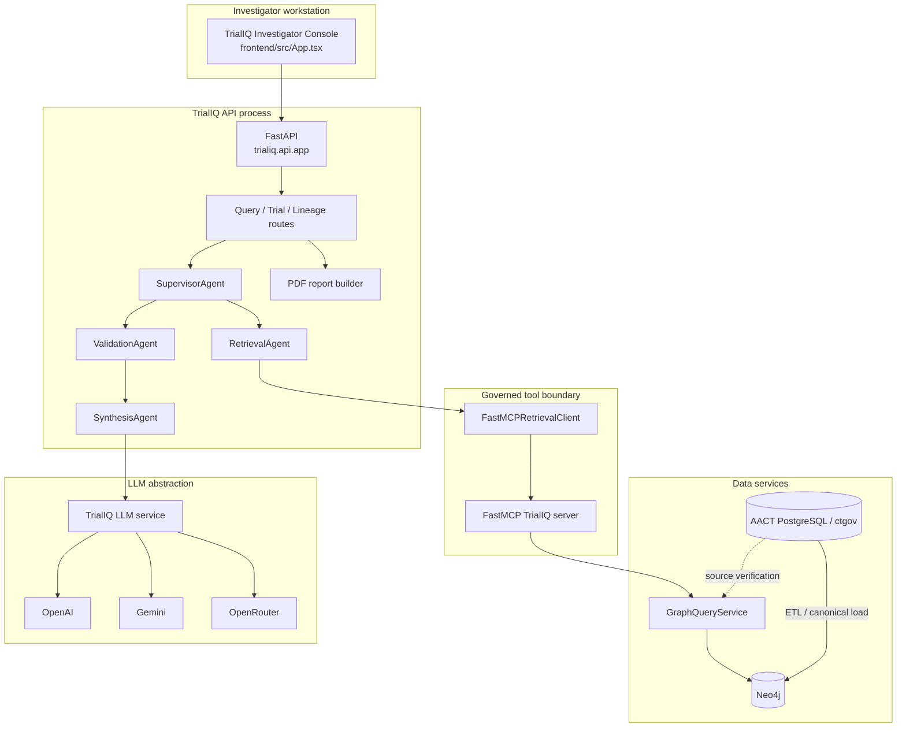

# TrialIQ System Architecture

## Purpose

This page describes the current TrialIQ architecture as implemented in the repository. It is not a target-state cloud diagram; every major box maps to a real TrialIQ module or runtime dependency.

## High-level architecture



## Runtime components

### Investigator Console

Location: `frontend/`

Responsibilities:

- study-of-interest selection;
- direct/guided question submission;
- HITL candidate review;
- Answer / Studies / Connections / Evidence result navigation;
- comparison/timeline presentation;
- source/provenance inspection;
- architecture/runtime inspection;
- report-section approval and PDF download.

The browser does not query Neo4j directly and does not generate Cypher.

### FastAPI application

Location: `src/trialiq/api/`

Responsibilities:

- HTTP contract;
- health/readiness endpoints;
- query routing;
- trial catalog and overview endpoints;
- graph/source lineage endpoints;
- guided-agent pause/resume endpoints;
- PDF report endpoint;
- CORS configuration.

### Agent layer

Location: `src/trialiq/agents/`

Key components:

- `SupervisorAgent` — coordinates retrieval, metrics trace, human review, validation and synthesis;
- `RetrievalAgent` — maps supported intent to controlled retrieval clients;
- `FastMCPRetrievalClient` — calls the TrialIQ MCP tools;
- `ValidationAgent` — determines whether retrieved evidence can be synthesized;
- `SynthesisAgent` — creates structured grounded synthesis;
- `human_review.py` — candidate checkpoint selection and bounded pause store;
- `report_pdf.py` — deterministic PDF rendering.

### MCP layer

Location: `src/trialiq/mcp/server.py`

MCP provides a named, typed, controlled tool surface. It is the intended transport for the guided graph workflow.

### Deterministic services

Location: `src/trialiq/services/`

Responsibilities include:

- graph queries;
- trial catalog;
- lineage;
- related-trial metrics;
- source verification;
- deterministic answer generation/formatting;
- graph-view DTO creation.

### Graph query layer

Location: `src/trialiq/chains/cypher_qa.py` and service wrappers.

The Cypher used by runtime query paths is owned by TrialIQ. The model does not supply arbitrary labels, relationships or raw Cypher.

### Neo4j

Role: canonical graph for related-study and evidence traversal.

Primary related-study relationship types:

- `HAS_CONDITION`
- `HAS_INTERVENTION`
- `SPONSORED_BY`

The graph also supports evidence/context structures outside the allowlisted related-study traversal.

### AACT PostgreSQL

Role: structured source used by ETL and source verification.

Expected local defaults from `.env.example`:

- host `localhost`;
- port `5432`;
- database `aact_full`;
- schema `ctgov`.

The database is not committed to Git.

### LLM service

Location: `src/trialiq/llm/`

The abstraction supports:

- OpenAI;
- Gemini;
- OpenRouter;
- automatic provider selection based on configured priority and health.

A startup preflight can test provider readiness. Provider/model identity is included in generation metadata without exposing secrets.

## Deployment shape of the stable demo

The stable local/demo deployment is intentionally simple:

```text
Browser
  -> localhost frontend
  -> localhost FastAPI
       -> in-process MCP client/server interaction
       -> localhost Neo4j
       -> configured LLM provider
       -> local AACT PostgreSQL for load/source verification
```

A separate permanently running MCP terminal is not required for the normal in-process client path, although the MCP server can be run independently for diagnostics.

## Production gaps intentionally not hidden

The current architecture does not claim to provide:

- production authentication/authorization;
- distributed durable human-review persistence;
- horizontal multi-instance state coordination;
- formal observability/SLOs;
- production rate limiting;
- managed secrets;
- automated AACT refresh scheduling;
- regulatory validation.

Those concerns belong to a future production architecture rather than the stable demo.

## Related diagrams

- [`diagrams/01-system-architecture.mmd`](diagrams/01-system-architecture.mmd)
- [`diagrams/11-component-boundaries.mmd`](diagrams/11-component-boundaries.mmd)
- [`diagrams/trialiq-system-architecture.drawio`](diagrams/trialiq-system-architecture.drawio)
